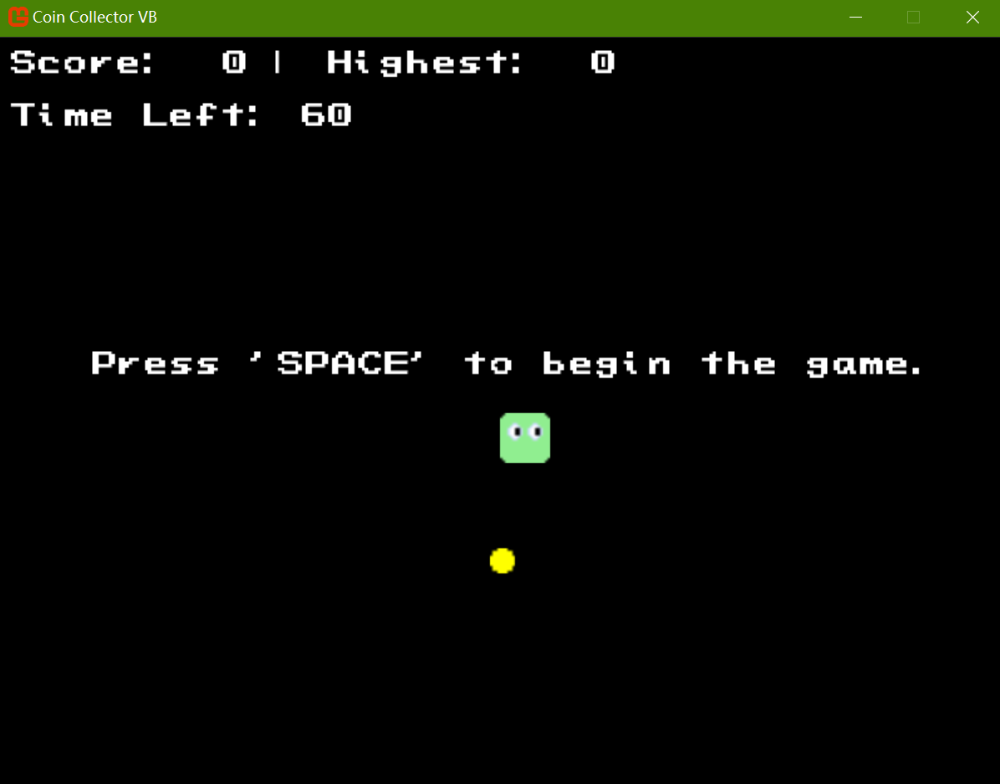
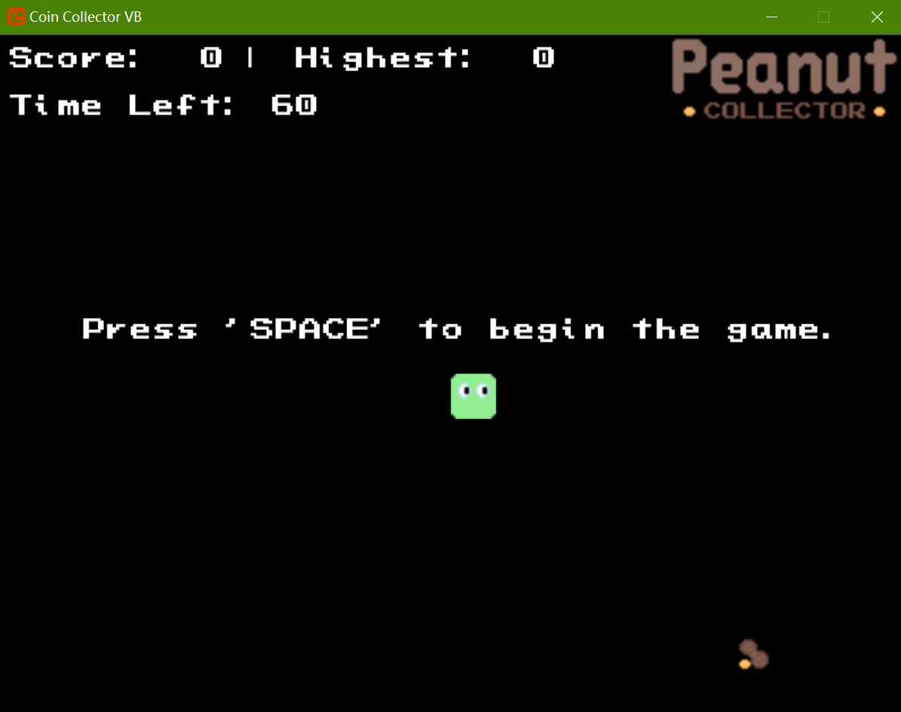

# Coin Collector VB - A Simple Coin Collecting Game



## Description
"Coin Collector VB" is a minimalist coin collecting game developed in VB.NET using the MonoGame framework. Set against a black-hued backdrop, the game offers a straightforward yet engaging experience. 

Players take control of a character using the arrow keys. As they navigate the screen, a unique position-wrapping mechanism ensures that the character seamlessly reappears on the opposite side of the screen when it reaches an edge.

The game features a 60-second countdown timer. The objective is to collect as many coins as possible before the timer runs out. Each coin is worth 1 point.

Players can also choose to play the game with peanuts as collectibles. However, it's important to note that peanuts only change the appearance of the game. They don't change the way the character moves or interact with the environment.



## Important Note
The game font file, `pac-land-new-concepts.ttf`, will be recognized by the MonoGame Content Builder if placed in the "Content" folder and specified in "game_font.spritefont" as shown below. _No need to manually install this font unless using it in your desktop system._
``` xml
<FontName>pac-land-new-concepts.ttf</FontName>
```

## Prerequisites
Before you can run the "Coin Collector VB" game, ensure you have the following software installed on your system:

### Integrated Development Environment (IDE)
You can use either of the following IDEs:
- **Visual Studio 2022**: A comprehensive IDE with rich features for .NET development.
- **Visual Studio Code**: A lightweight and highly customizable code editor.

### .NET SDK
Install [.NET SDK Version 8.0 or higher](https://dotnet.microsoft.com/en-us/download). This is essential for building and running the VB.NET application.

### MonoGame Template
Install the MonoGame template using the following command in your terminal:
``` bash
dotnet new install MonoGame.Templates.CSharp
```

## Additional Setup Steps
Depending on the IDE you choose, you'll need to perform some extra setup steps:

### Visual Studio 2022
Install the following extensions from the Visual Studio Marketplace:
- **MonoGame Framework C# project templates**: Provides project templates for MonoGame development.
- **Code Converter (VB-C#)**: Useful for converting code between VB.NET and C#.

### Visual Studio Code
1. Clone the VB.NET MonoGame template to your local machine using the following command:
``` bash
git clone https://github.com/AristurtleDev/monogame-visual-basic-example.git
```
2. Install the "MonoGame for VS Code" extension created by r88 from the Visual Studio Code Marketplace. This extension enhances MonoGame development within the editor.

## How to Play
1. Open your terminal and clone the repository to your local machine:
```bash
git clone https://github.com/Pac-Dessert1436/Coin-Collector-VB.git
```
2. Navigate to the project directory:
```bash
cd Coin-Collector-VB
```
3. Install the required packages:
```bash
dotnet restore
```
4. Compile the project and start the game:
```bash
dotnet build
dotnet run
```
5. While the game is running:
    - Use the arrow keys to move the character.
    - Collect as many coins as you can before the 60-second timer runs out.
    - When the game ends, restart the game by pressing the "R" key.

## License
This project is licensed under the MIT License. For more details, refer to the [LICENSE](LICENSE) file in this repository.