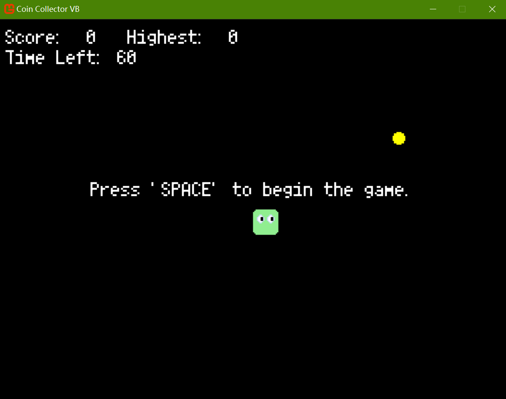
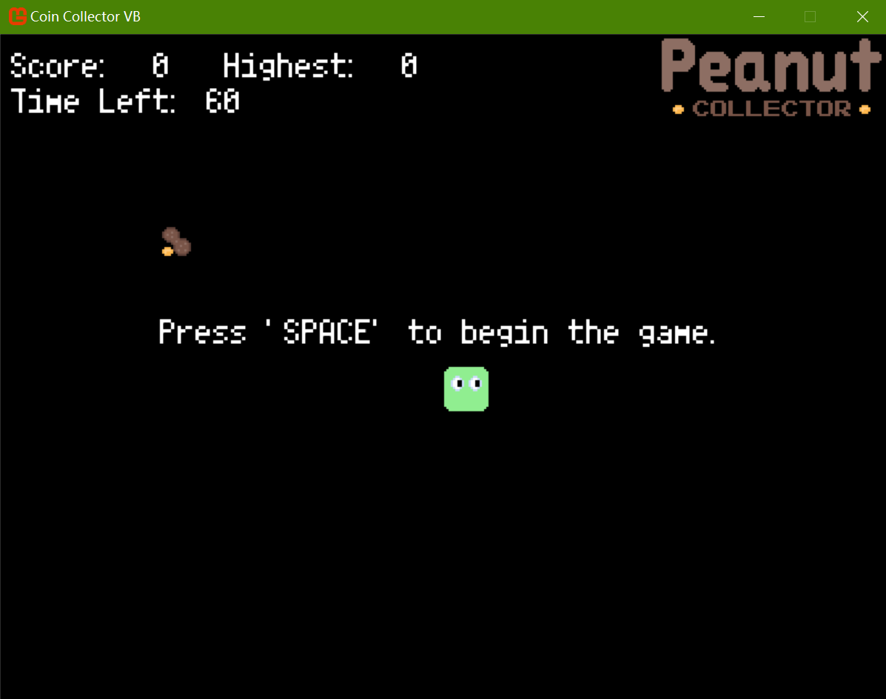

# Coin Collector VB - A Simple Coin Collecting Game



## Description
_Coin Collector VB_ is a minimalist coin-collecting game built with VB.NET and MonoGame. Navigate a character using arrow keys across a black backdrop, with seamless screen-edge wrapping that lets you reappear on the opposite side instantly.

Race against a 60-second timer (no pause functionality currently available) to collect as many coins as possible—each worth 1 point. For a visual twist, you can also choose to collect peanuts instead of coins (this only changes the collectible's appearance, not gameplay mechanics).



> **Note:** The game has been upgraded to .NET SDK 10.0 and now uses the [Fusion Pixel Font](https://github.com/TakWolf/fusion-pixel-font).

## Prerequisites
Ensure you have the following software installed on your system before running the game:

### Integrated Development Environment (IDE)
You can use either of the following IDEs:
- **Visual Studio 2026**: A comprehensive IDE with rich features for .NET development.
- **Visual Studio Code**: A lightweight and highly customizable code editor.

### .NET SDK
Install [.NET SDK Version 10.0 or higher](https://dotnet.microsoft.com/en-us/download). This is essential for building and running the VB.NET application.

### MonoGame Template
Install the MonoGame template using the following command in your terminal:
``` bash
dotnet new install MonoGame.Templates.CSharp
```

## Additional Setup Steps
Depending on the IDE you choose, you'll need to perform some extra setup steps:

### Visual Studio 2026
Install the following extensions from the Visual Studio Marketplace:
- **MonoGame Framework C# project templates**: Provides project templates for MonoGame development.
- **Code Converter (VB-C#)**: Useful for converting code between VB.NET and C#.

### Visual Studio Code
1. Clone the VB.NET MonoGame template to your local machine using the following command:
``` bash
git clone https://github.com/AristurtleDev/monogame-visual-basic-example.git
```
2. Install the "MonoGame for VS Code" extension created by r88 from the Visual Studio Code Marketplace. This extension enhances MonoGame development within the editor.

## How to Play
1. Open your terminal and clone the repository to your local machine:
```bash
git clone https://github.com/Pac-Dessert1436/Coin-Collector-VB.git
```
2. Navigate to the project directory:
```bash
cd Coin-Collector-VB
```
3. Install the required packages:
```bash
dotnet restore
```
4. Compile the project and start the game:
```bash
dotnet build
dotnet run
```
5. While the game is running:
    - Use the arrow keys to move the character.
    - Collect as many coins as you can before the 60-second timer runs out.
    - When the game ends, restart the game by pressing the "R" key.

## License
This project is licensed under the MIT License. For more details, refer to the [LICENSE](LICENSE) file in this repository.